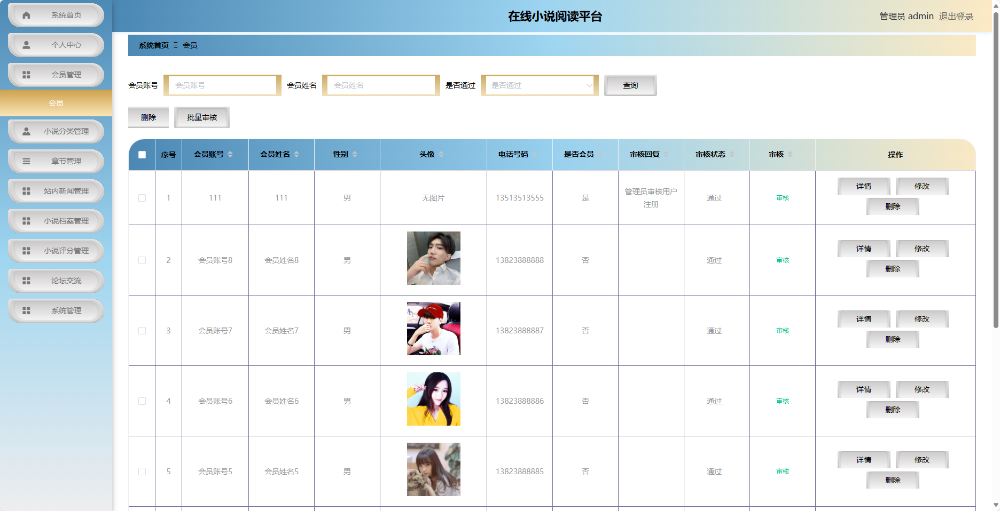
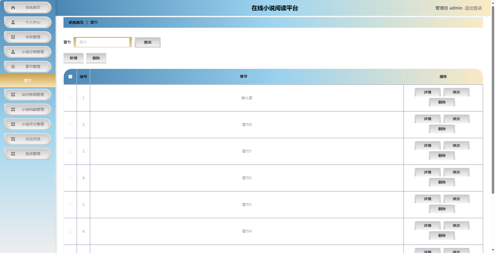
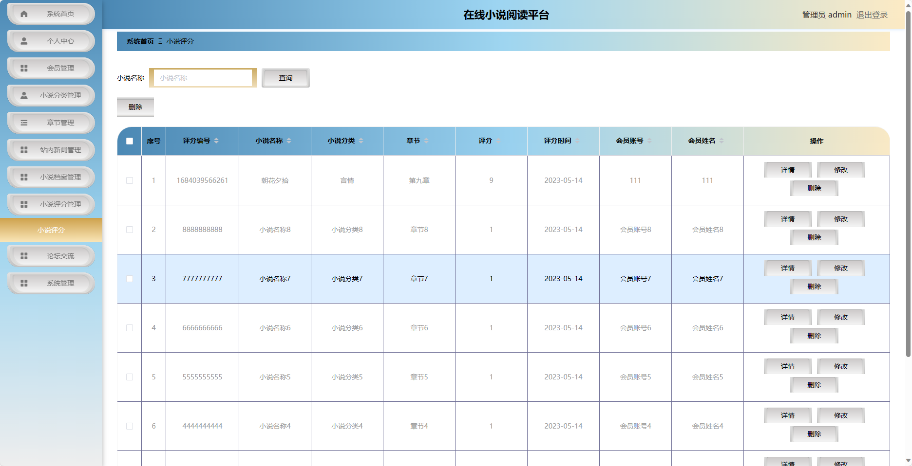

## 基于SpringBoot的在线小说阅读平台

###  获取sql数据库文件: 从戎源码网 (https://armycodes.com/) QQ: 386869957 QQ群: 377586148
###  所有系统地址: (https://github.com/YuLin-Coder/AllProjectCatalog) 
###  所有项目以及源代码本人均调试运行无问题 可支持远程安装部署调试、定制修改、代码讲解

## 项目介绍
基于SpringBoot的在线小说阅读平台，系统包含两种角色：管理员、用户,系统分为前台和后台两大模块，主要功能如下。

### 【管理员】:
- 个人中心：管理员可以管理个人信息，修改密码等。
- 会员管理：管理员可以管理用户信息，包括添加、编辑和删除用户信息。
- 小说分类管理：管理员可以管理小说的分类信息，包括添加、编辑和删除分类。
- 章节管理：管理员可以管理小说的章节信息，包括添加、编辑和删除章节。
- 站内新闻管理：管理员可以管理站内新闻信息，包括添加、编辑和删除新闻。
- 小说档案管理：管理员可以管理小说的信息，包括添加、编辑和删除小说。
- 小说评分管理：管理员可以管理用户对小说的评分信息，包括查看和删除评分。
- 论坛交流：管理员可以管理论坛话题和回复，包括删除不当内容。
- 系统管理：管理员可以管理系统的相关配置，包括日志管理、权限管理等。

### 【前台】:
- 首页：展示站内新闻、精选小说推荐等内容。
- 站内新闻：展示平台的最新动态和公告信息。
- 小说档案：提供小说的分类列表和搜索功能。
- 论坛交流：用户可以在论坛上讨论小说、分享阅读心得等。
- 新闻公告：展示平台发布的新闻和公告信息。
- 个人中心：用户可以管理个人信息，查看已购买的小说、参与的论坛话题等。

## 项目技术
- 编程语言：Java
- 数据库：MySQL
- 项目管理工具：Maven
- 前端技术：HTML、CSS、JavaScript、Jquery、Vue
- 后端技术：Spring、SpringMVC、MyBatis

## 运行环境
- JDK版本：JDK1.8及以上
- 开发工具：IDEA、Ecplise、Myecplise都可以
- 数据库: MySQL5.7及以上
- Maven：maven3.0及以上
- Node：14.14.0及以上

## 运行截图

